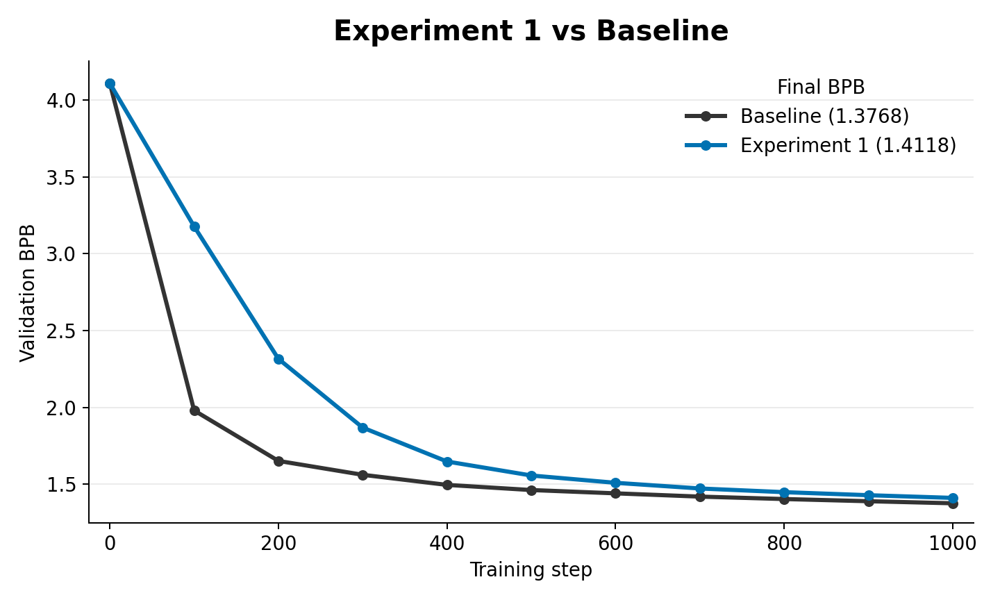

# Experiment 1: Bigram Prior Logit Injection

Give the student a frozen bigram prior from the training data and add it directly to the model logits.

## Contents

- [How the bigram prior is created](#how-the-bigram-prior-is-created)
- [How the prior is loaded into the experiment](#how-the-prior-is-loaded-into-the-experiment)
- [Code changes from `train_gpt.py`](#code-changes-from-train_gptpy)
- [Important files](#important-files)
- [Results](#results)
- [How this led to experiment 2](#how-this-led-to-experiment-2)

## How the bigram prior is created

The bigram table is created by `data/bigram_prior_extract.py`.

That script reads tokenized FineWeb shards, skips the 1024-byte shard header, and loads the remaining tokens as `uint16`. It then counts adjacent token pairs:

- `t0 = tokens[:-1]`: previous/current input token.
- `t1 = tokens[1:]`: next target token.
- `pair_id = t0 * vocab_size + t1`: flattened bigram id.

From those counts it computes a smoothed estimate of `P(next_token | previous_token)` using `alpha_smooth = 0.1`. It stores only the observed bigrams sparsely, plus a per-row default probability for unseen next tokens. The saved `.npz` contains:

- `rows`: previous-token ids with observed outgoing bigrams.
- `cols`: next-token ids for those observed bigrams.
- `log_probs`: clipped smoothed log probabilities for observed bigrams.
- `default_log_probs`: clipped smoothed log probabilities for unseen bigrams in each previous-token row.

Typical creation command:

```bash
python data/bigram_prior_extract.py \
  --pattern "./data/datasets/fineweb10B_sp1024/fineweb_train_*.bin" \
  --vocab-size 1024 \
  --max-files 80 \
  --output bigram_prior.npz
```

## How the prior is loaded into the experiment

`bigram_prior.py` points `BIGRAM_PRIOR_PATH` at that `.npz`. The `BigramPrior.load(...)` method checks for the four required arrays, then builds a dense `[vocab_size, vocab_size]` lookup table:

- each row starts filled with that row's `default_log_probs`
- observed `(row, col)` entries are overwritten with the saved `log_probs`
- the table is registered as a non-persistent buffer, so it affects training but is not saved into `final_model.pt`

During the model forward pass, the current input token indexes this table. Because the model is trained as next-token prediction, that current input token is the previous token for the target at the same position. The selected row becomes an additive vocabulary-sized logit bias.

The strength is controlled by:

- `PRIOR_ALPHA_START`: starting strength of the prior.
- `PRIOR_MAX_STEP`: step where the prior decays to zero.

`get_alpha(step, PRIOR_MAX_STEP, PRIOR_ALPHA_START)` applies a quadratic decay:

```text
alpha = PRIOR_ALPHA_START * (1 - step / PRIOR_MAX_STEP)^2
```

Validation passes `prior_alpha = 0`, so the recorded validation metric tests the trained student itself, not a model that is still receiving the external prior.

## Code changes from `train_gpt.py`

The meaningful changes in `experiment_1/bigram_prior.py` are:

- Added `BIGRAM_PRIOR_PATH`, `PRIOR_MAX_STEP`, and `PRIOR_ALPHA_START` to `Hyperparameters`.
- Added the `BigramPrior` module that loads the sparse `.npz` and turns it into a dense lookup table.
- Added `get_alpha(...)` to decay the prior during training.
- Added `bigram_prior_path` to the `GPT` constructor and stored `self.bigram_prior`.
- Changed `GPT.forward(...)` to accept `prior_alpha`.
- Added `prior_alpha * self.bigram_prior(input_ids)` to the logits before softcapping and cross-entropy.
- Set warmup and validation prior strength to zero, so the measured validation path is not directly using the external prior.
- Logged whether the prior is enabled and the prior schedule values.

## Important files

- `../data/bigram_prior_extract.py`: creates the sparse smoothed bigram prior file.
- `bigram_prior.py`: experiment script that loads and injects the prior.

## Results



In the matched 1000-step smoke run, direct bigram prior injection underperformed the baseline. The baseline reached `1.3768` validation BPB, while `small_exp_1_750` reached `1.4118`, a `0.0350` BPB disadvantage for Experiment 1.

## How this led to experiment 2

Direct logit injection is a hard intervention: the model sees logits that partly come from outside itself. The next question was whether the prior would be more useful as a soft training target instead of a direct output modification.

That led to experiment 2: keep the same bigram source, but use it as a KL regularizer.
