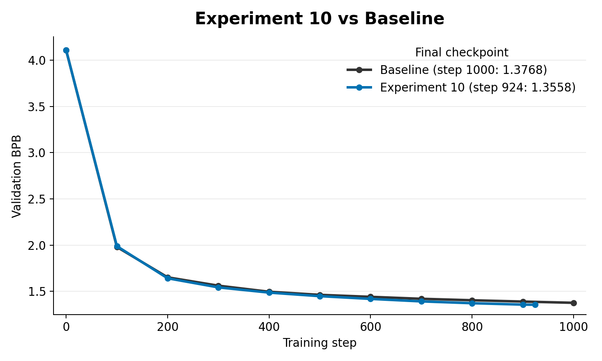

# Experiment 10: Same-Size Relational KD

This experiment distills hidden-state geometry from a same-architecture teacher. `relational_kd.py` captures a selected hidden layer from student and teacher, then compares relational structure rather than raw activations.

It supports three modes:

- `sample`: compare sample-to-sample geometry after pooling each sequence.
- `token`: compare token-to-token geometry inside each sequence.
- `both`: combine sample-level and token-level relational losses.

The token-level path also logs a magnitude term so it is possible to see whether the student matches only neighborhoods or also relative activation scale.

## Contents

- [How this came from experiment 9](#how-this-came-from-experiment-9)
- [What changed from experiment 9](#what-changed-from-experiment-9)
- [How the teacher signal is created](#how-the-teacher-signal-is-created)
- [How the teacher is loaded into the experiment](#how-the-teacher-is-loaded-into-the-experiment)
- [Code changes from `train_gpt.py`](#code-changes-from-train_gptpy)
- [Important files](#important-files)
- [Results](#results)
- [How this led to experiment 11](#how-this-led-to-experiment-11)

## How this came from experiment 9

Experiments 7 through 9 tested teacher information stored in weights and subspaces. Experiment 10 moved to teacher behavior on data: what relationships does the teacher create among tokens and samples?

This begins the "which teacher signal is best?" phase.

## What changed from experiment 9

- Loaded a frozen same-size teacher.
- Captured hidden states instead of weight subspaces.
- Added `RELKD_MODE`, `RELKD_LAYER`, `RELKD_LAMBDA`, and token subsampling controls.
- Compared relational similarity matrices rather than direct hidden-state MSE.

## How the teacher signal is created

The teacher signal is produced online from a frozen same-architecture teacher checkpoint. For each training batch, student and teacher hidden states are captured at `RELKD_LAYER`.

The important object is not the raw hidden vector. It is the relation matrix induced by those hidden vectors: sample-to-sample similarity after pooling, token-to-token similarity within a sequence, or both.

## How the teacher is loaded into the experiment

`RELKD_TEACHER_PATH` points at the checkpoint. `relational_kd.py` constructs the same model shape as the student, loads the teacher weights, freezes the teacher, and runs it under `torch.no_grad()`.

The student path returns CE loss plus a selected hidden layer. The teacher path returns the matching hidden layer. The KD loss compares normalized relational geometry, with optional token stride and max-token subsampling to keep the token relation path affordable.

## Code changes from `train_gpt.py`

`../train_gpt.py` is the baseline comparison script. The meaningful changes in `experiment_10/relational_kd.py` are:

- Added `RELKD_MODE`, `RELKD_TEACHER_PATH`, `RELKD_LAYER`, `RELKD_LAMBDA`, sample/token/magnitude weights, pooling mode, token stride, and max-token controls.
- Added hidden-state return paths such as `return_hidden`/`forward_hidden`.
- Added `sample_rkd_loss(...)` for pooled sequence relation matching.
- Added token-level geometry loss for within-sequence token relations.
- Loaded and froze a same-size teacher model.
- Changed the training objective to `CE + RELKD_LAMBDA * relational_KD`.
- Logged sample relation loss, token relation loss, token magnitude diagnostics, and CE separately.

## Important files

- `relational_kd.py`: same-size relational KD script.

## Results

The same-size relational KD smoke run stopped at step `924` and reached `1.3558` validation BPB. Even before completing the full 1000-step comparison, this was better than the 1000-step baseline value of `1.3768`.

## How this led to experiment 11

Relational KD compares hidden states to each other. The next idea was to compare each hidden state to a fixed set of semantic anchors: the teacher's token embeddings.

That led to experiment 11: activation embedding KL, an idea I got from reading about JEPA.
