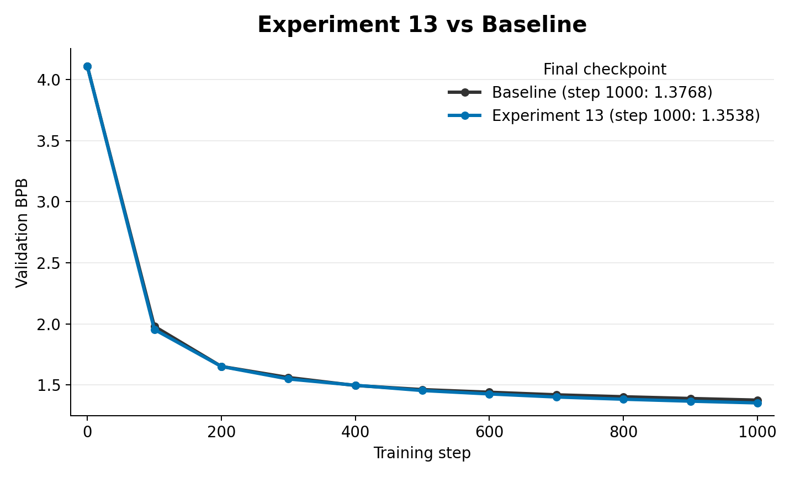

# Experiment 13: Relational KD from a Larger Teacher

This experiment extends relational KD to a larger teacher model. `bigteacher_relational_kd.py` keeps the student architecture fixed, but lets the teacher use separate shape controls:

- `RELKD_TEACHER_NUM_LAYERS`
- `RELKD_TEACHER_MODEL_DIM`
- `RELKD_TEACHER_NUM_HEADS`
- `RELKD_TEACHER_NUM_KV_HEADS`
- `RELKD_TEACHER_LAYER`

Because raw hidden dimensions differ between teacher and student, this experiment focuses on relational quantities such as token-to-token similarity structure rather than direct activation matching.

## Contents

- [How this came from experiment 12](#how-this-came-from-experiment-12)
- [What changed from experiment 12](#what-changed-from-experiment-12)
- [How the teacher signal is created](#how-the-teacher-signal-is-created)
- [How the teacher is loaded into the experiment](#how-the-teacher-is-loaded-into-the-experiment)
- [Code changes from `train_gpt.py`](#code-changes-from-train_gptpy)
- [Important files](#important-files)
- [Results](#results)
- [How this led to experiment 14](#how-this-led-to-experiment-14)

## How this came from experiment 12

Experiment 12 used same size logit KD as a standard baseline. The next question was whether a larger teacher could provide a better signal, especially for hidden state relational KD where the teacher's internal representation might be richer.

This experiment revisits experiment 10 with a stronger, differently shaped teacher.

## What changed from experiment 12

- Returned from logit KD to relational hidden state KD.
- Added separate teacher architecture controls.
- Added teacher layer mapping so the student can compare one of its layers to a selected teacher layer.
- Continued to test token level relational losses and layer choices.

## How the teacher signal is created

The signal is the same kind of relational hidden state geometry from experiment 10, but produced by a larger teacher checkpoint. Because the teacher hidden dimension can differ from the student hidden dimension, direct hidden MSE is avoided.

The common comparison space is relation structure: which tokens are similar to which other tokens according to each model's selected hidden layer.

## How the teacher is loaded into the experiment

`RELKD_TEACHER_PATH` points at the larger teacher checkpoint. `bigteacher_relational_kd.py` constructs the teacher with separate architecture controls, including number of layers, model dimension, attention heads, KV heads, MLP multiplier, and selected teacher layer.

Student hidden states come from `RELKD_LAYER`; teacher hidden states come from `RELKD_TEACHER_LAYER`. The KD loss compares their relational structure after normalization and token subsampling.

## Code changes from `train_gpt.py`

`../train_gpt.py` is the baseline comparison script. The meaningful changes in `experiment_13/bigteacher_relational_kd.py` are:

- Kept the relational KD losses from experiment 10.
- Added separate teacher shape controls: `RELKD_TEACHER_NUM_LAYERS`, `RELKD_TEACHER_MODEL_DIM`, `RELKD_TEACHER_NUM_HEADS`, `RELKD_TEACHER_NUM_KV_HEADS`, and `RELKD_TEACHER_MLP_MULT`.
- Added `RELKD_TEACHER_LAYER` so teacher and student layer indices can differ.
- Constructed, loaded, froze, and evaluated a larger teacher model.
- Compared relation matrices instead of raw activations so different hidden widths can be used.
- Logged relational KD components and teacher shape settings.

## Important files

- `bigteacher_relational_kd.py`: largeteacher relational KD script.

## Results

In the matched 1000-step smoke run, relational KD from the larger teacher improved over the baseline. The baseline reached `1.3768` validation BPB, while `small_exp_13` reached `1.3538`, a `0.0230` BPB improvement for Experiment 13.

## How this led to experiment 14

The results show similar performance to the smaller teacher, which is very odd. Therefore, I wanted to run a diagnostic with the logit kd using the big teacher. I am hoping that the performance is better than the smaller teacher for logit kd. 

That led to experiment 14: large teacher logit KD.
