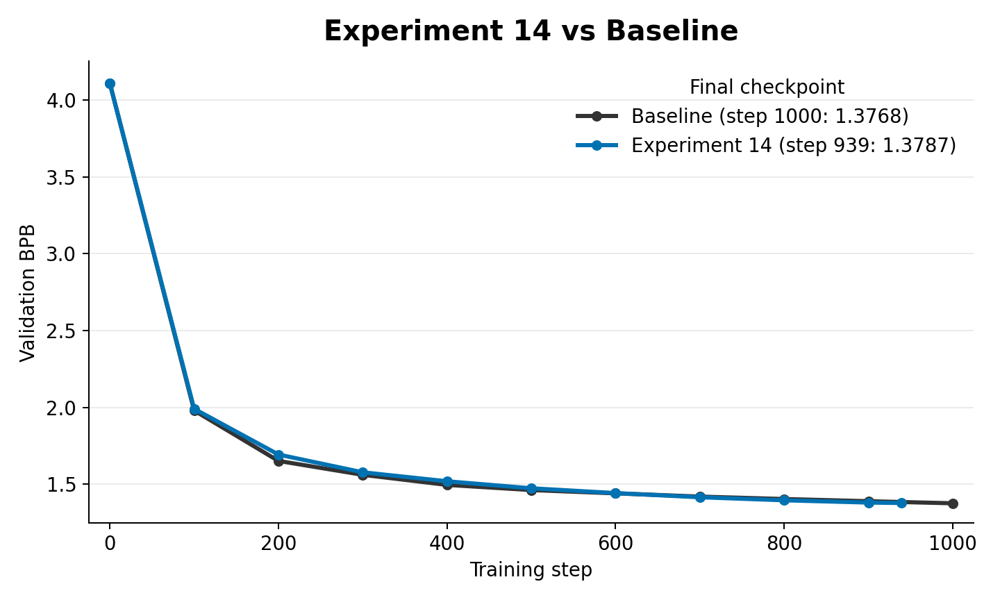

# Experiment 14: Logit KD from a Different Sized Teacher

This is mainly a diagnostic run to compare against the old teacher logit kd to see if a big teacher signal performs better.

## Contents

- [Results](#results)
- [How this led to experiment 15](#how-this-led-to-experiment-15)

## Results

The big-teacher logit KD smoke run stopped at step `939` and reached `1.3787` validation BPB. This was essentially tied with, but slightly worse than, the 1000-step baseline value of `1.3768`.

## How this led to experiment 15

The experiment showed inconclusive results, i.e., the bigger teacher performed no better in the early phase of training (1000 steps). Therefore, to make any conclusions, I'd have to do a larger run to compare the two. So I put this aside for now until I got the compute.

As a result, I was reading about compression techniques and I got inspired to see if one of the student's layers can copy two of the teachers'.

That led to experiment 15: teacher transformation KD.
