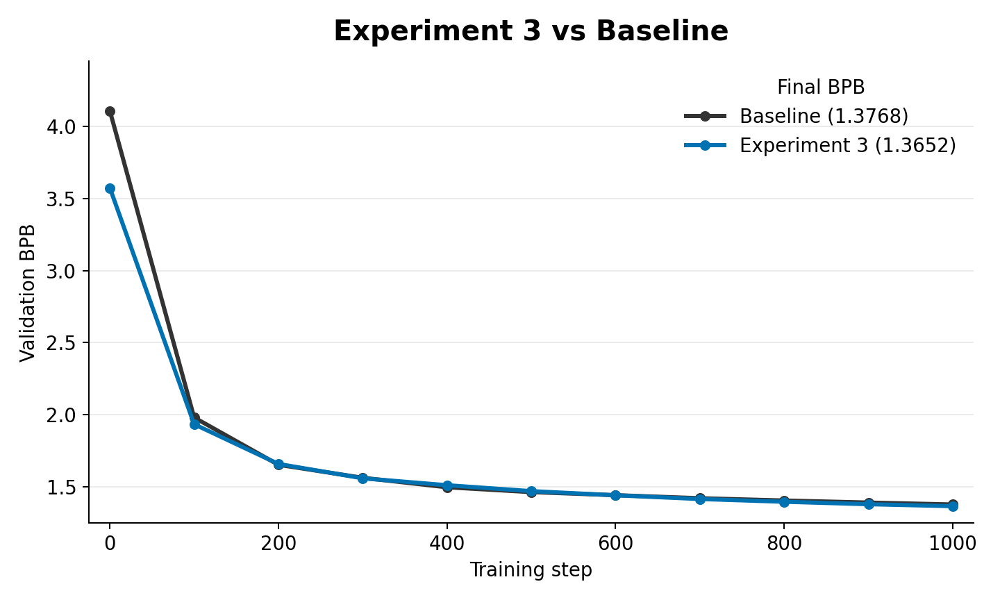

# Experiment 3: Unigram Output-Head Bias

This experiment adds a learned per-token bias to the LM output head. The bias can be initialized from data unigram probabilities, then trained normally with the rest of the scalar/vector parameters.

`unigram_bias.py` adds `lm_head_bias` and, when enabled, initializes it from `UNIGRAM_PROBS_PATH` using centered log probabilities scaled by `UNIGRAM_BIAS_TAU`.

The result is a model that can represent:

- context dependent logits from the transformer
- plus a contexti ndependent token frequency bias

## Contents

- [How this came from experiment 2](#how-this-came-from-experiment-2)
- [What changed from experiment 2](#what-changed-from-experiment-2)
- [How the unigram prior is created](#how-the-unigram-prior-is-created)
- [How the prior is loaded into the experiment](#how-the-prior-is-loaded-into-the-experiment)
- [Code changes from `train_gpt.py`](#code-changes-from-train_gptpy)
- [Important files](#important-files)
- [Results](#results)
- [How this led to experiment 4](#how-this-led-to-experiment-4)

## How this came from experiment 2

Experiment 2 still treated the data prior as a training target. Experiment 3 moved the data-prior idea into the model parameterization itself. Instead of only regularizing toward token statistics, the model gets an explicit trainable slot for unigram base rates.

This was still in the data prior phase: the prior comes from data statistics, not from another trained model.

## What changed from experiment 2

- Added `lm_head_bias`.
- Added optional unigram initialization from a saved probability vector.

## How the unigram prior is created

The unigram probability vector is created by `../data/unigram_prior_extract.py`. That script reads the tokenized FineWeb shard format, skips the 1024-byte header, counts token ids with `np.bincount`, applies `alpha_smooth = 0.1`, normalizes the counts into probabilities, and saves a torch tensor.

The expected output is `unigram_probs.pt`, a length-`vocab_size` probability vector whose entries sum to 1.

## How the prior is loaded into the experiment

`unigram_bias.py` uses `UNIGRAM_PROBS_PATH` when `USE_UNIGRAM_BIAS_INIT` is enabled. The tensor is loaded with `torch.load`, reshaped to `[vocab_size]`, checked against the model vocabulary size, and registered as a non-persistent buffer.

Initialization converts probabilities into centered log probabilities:

```text
lm_head_bias = UNIGRAM_BIAS_TAU * (log(p) - mean(log(p)))
```

After initialization, `lm_head_bias` is a normal trainable parameter. The corpus prior only chooses its starting value.

## Code changes from `train_gpt.py`

`../train_gpt.py` is the baseline comparison script. The meaningful changes in `experiment_3/unigram_bias.py` are:

- Added unigram controls: `USE_UNIGRAM_BIAS_INIT`, `UNIGRAM_PROBS_PATH`, and `UNIGRAM_BIAS_TAU`.
- Added `lm_head_bias` as a trainable vocabulary-sized parameter.
- Added optional loading and validation of the saved unigram probability tensor.
- Changed output logits to include `lm_head_bias` before loss computation.
- Added the bias parameter to the Adam/scalar optimizer group.
- Logged whether unigram bias initialization is enabled and which prior file was used.

## Important files

- `../data/unigram_prior_extract.py`: creates the unigram probability tensor used for bias initialization.
- `unigram_bias.py`: experiment script.

## Results



In the matched 1000-step smoke run, unigram output-head bias improved over the baseline. The baseline reached `1.3768` validation BPB, while `small_exp_3` reached `1.3652`, a `0.0116` BPB improvement for Experiment 3.

## How this led to experiment 4

After trying scalar token frequencies, the next question was whether richer token-token structure could initialize the embedding geometry itself.

That led to experiment 4: use a low-rank SVD of the bigram/co-occurrence matrix to initialize embeddings and the output head.
