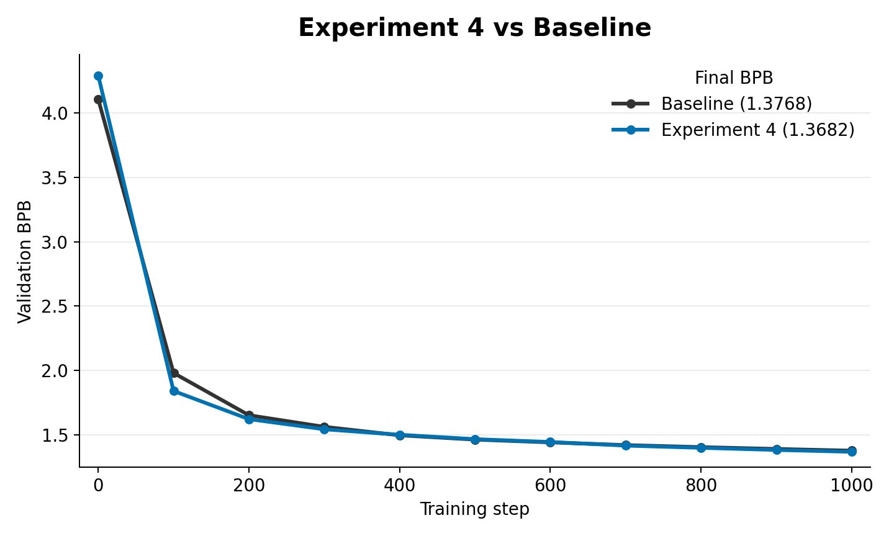

# Experiment 4: Low-Rank Bigram SVD Initialization

This experiment initializes the token embedding space from a low-rank factorization of a token-token bigram/co-occurrence matrix.

`lowrank_svd_init.py` loads a dense or sparse bigram matrix, builds either raw log-probability or row-centered log-probability features, runs SVD, and uses the low-rank factors to initialize:

- `tok_emb.weight`
- `lm_head.weight` when embeddings are untied

This is an initialization-only data prior. The SVD factors do not create a persistent loss, output bias, direct bigram-prior path, or adapter after training starts.

## Contents

- [How this came from experiment 3](#how-this-came-from-experiment-3)
- [What changed from experiment 3](#what-changed-from-experiment-3)
- [How the bigram matrix is created](#how-the-bigram-matrix-is-created)
- [How the matrix is loaded into the experiment](#how-the-matrix-is-loaded-into-the-experiment)
- [Code changes from `train_gpt.py`](#code-changes-from-train_gptpy)
- [Important files](#important-files)
- [Results](#results)
- [How this led to experiment 5](#how-this-led-to-experiment-5)

## How this came from experiment 3

Experiment 3 gave the output head a learned base-rate bias. Experiment 4 asked whether data statistics could shape the entire token representation geometry, not just a per-token scalar.

The shift was from "add a bias to logits" to "start the model in a better token space."

## What changed from experiment 3

- Added `USE_LOWRANK_BIGRAM_INIT`.
- Added `LOWRANK_BIGRAM_PATH`.
- Added `LOWRANK_INIT_RANK`, `LOWRANK_INIT_MATRIX`, `LOWRANK_INIT_SCALE`, and noise controls.
- Used SVD-derived initialization instead of a persistent prior term.

## How the bigram matrix is created

The usual source is the same sparse `.npz` produced by `../data/bigram_prior_extract.py`: tokenized shards are read, adjacent token pairs are counted, smoothed conditional log probabilities are written as `rows`, `cols`, `log_probs`, and `default_log_probs`.

`lowrank_svd_init.py` can also read a dense `.npz` that contains `mat`, but the sparse bigram-prior output is enough because the script can reconstruct the dense matrix internally.

## How the matrix is loaded into the experiment

`LOWRANK_BIGRAM_PATH` points at the `.npz` file. `load_dense_bigram_matrix(...)` accepts either:

- a dense `mat` array
- or the sparse bigram-prior arrays from the extractor

It builds a `[vocab_size, vocab_size]` matrix, either using raw log probabilities (`LOWRANK_INIT_MATRIX=logp`) or row-centered log probabilities (`LOWRANK_INIT_MATRIX=centered_logp`). Then `make_lowrank_init_factors(...)` runs SVD and turns the top factors into initial token embedding and optional output-head weights.

The SVD prior is used only during model initialization. It is not added to the training loss and it is not a separate runtime module.

## Code changes from `train_gpt.py`

`../train_gpt.py` is the baseline comparison script. The meaningful changes in `experiment_4/lowrank_svd_init.py` are:

- Added low-rank controls: `USE_LOWRANK_BIGRAM_INIT`, `LOWRANK_BIGRAM_PATH`, `LOWRANK_INIT_RANK`, `LOWRANK_INIT_MATRIX`, `LOWRANK_INIT_SCALE`, `LOWRANK_INIT_EPS`, and `LOWRANK_INIT_NOISE_STD`.
- Added dense/sparse bigram matrix loading.
- Added SVD factor construction for token-token statistics.
- Copied the left factor into `tok_emb.weight`.
- Copied the right factor into `lm_head.weight` when embeddings are untied.
- Logged the low-rank source path, matrix type, rank, scale, and whether initialization was enabled.

## Important files

- `../data/bigram_prior_extract.py`: creates the sparse smoothed bigram matrix usually used here.
- `lowrank_svd_init.py`: experiment script.

## Results

In the matched 1000-step smoke run, low-rank bigram SVD initialization improved over the baseline. The baseline reached `1.3768` validation BPB, while `small_exp_4` reached `1.3682`, a `0.0086` BPB improvement for Experiment 4.

## How this led to experiment 5

Experiment 4 used bigram structure only at initialization. The natural follow-up was to ask whether a small, dedicated bigram pathway should remain active throughout training.

That led to experiment 5: a trainable low-rank bigram adapter.
