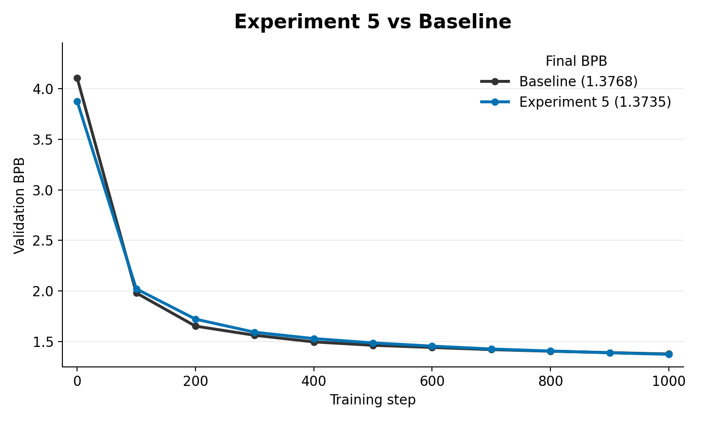

# Experiment 5: Trainable Low-Rank Bigram Adapter

This experiment adds a trainable low-rank token-to-token transition module. Instead of only using bigram statistics to initialize embeddings, the model gets a compact learned adapter that contributes additive logits throughout training.

`trainable_low_rank_adapter_lg.py` adds:

- `bigram_adapter_A`: previous-token embedding into a low-rank transition space.
- `bigram_adapter_B`: maps that transition space back to vocabulary logits.
- `bigram_adapter_scale`: learned scalar controlling adapter strength.

For each token position, the previous token selects a row of `A`; that vector is multiplied by `B.T` to produce a vocabulary-sized logit correction.

## Contents

- [How this came from experiment 4](#how-this-came-from-experiment-4)
- [What changed from experiment 4](#what-changed-from-experiment-4)
- [How the adapter prior is created](#how-the-adapter-prior-is-created)
- [How the prior is loaded into the experiment](#how-the-prior-is-loaded-into-the-experiment)
- [Code changes from `train_gpt.py`](#code-changes-from-train_gptpy)
- [Important files](#important-files)
- [Results](#results)
- [How this led to experiment 6](#how-this-led-to-experiment-6)

## How this came from experiment 4

Experiment 4 asked whether data co-occurrence geometry was useful as an initialization. Experiment 5 asked whether the same kind of structure should be an explicit model component that can adapt during training.

This is the persistent, trainable version of the low-rank data-prior idea.

## What changed from experiment 4

- Moved from init-only to trainable adapter.
- Added adapter-specific rank and learning-rate controls.
- Supported SVD initialization of the adapter from a bigram matrix.
- Added optimizer handling for the adapter parameters.

## How the adapter prior is created

The adapter can be initialized from the same bigram statistics used in experiments 1, 2, and 4. `../data/bigram_prior_extract.py` builds a smoothed sparse `.npz` bigram table from tokenized FineWeb shards.

That prior is not the whole model path anymore. It is only an optional initializer for the trainable adapter.

## How the prior is loaded into the experiment

`BIGRAM_ADAPTER_INIT_PATH` points at the `.npz` file. `trainable_low_rank_adapter_lg.py` can load either a dense `mat` array or the sparse bigram-prior arrays, reconstruct a vocabulary-by-vocabulary transition matrix, and use truncated SVD when `BIGRAM_ADAPTER_INIT_MODE=svd`.

The resulting factors initialize `bigram_adapter_A` and `bigram_adapter_B`. During training, the adapter remains active and trainable:

```text
adapter_logits = bigram_adapter_A[input_ids] @ bigram_adapter_B.T
logits = model_logits + bigram_adapter_scale * adapter_logits
```

## Code changes from `train_gpt.py`

The meaningful changes in `experiment_5/trainable_low_rank_adapter_lg.py` are:

- Added `BIGRAM_ADAPTER_RANK`, `BIGRAM_ADAPTER_LR`, `BIGRAM_ADAPTER_INIT_PATH`, `BIGRAM_ADAPTER_INIT_MODE`, `BIGRAM_ADAPTER_INIT_SCALE`, and `BIGRAM_ADAPTER_SCALE_INIT`.
- Added trainable adapter parameters `bigram_adapter_A`, `bigram_adapter_B`, and `bigram_adapter_scale`.
- Added optional SVD initialization from a dense or sparse bigram matrix.
- Added adapter logits to the normal transformer logits during the forward pass.
- Added adapter parameters to the optimizer with their own learning-rate control.
- Logged adapter rank, scale, learning rate, initialization mode, and prior source.

## Important files

- `../data/bigram_prior_extract.py`: creates the optional bigram initializer for the adapter.
- `trainable_low_rank_adapter_lg.py`: experiment script.
- `low_rank_adapter_10m.txt`

## Results



In the matched 1000-step smoke run, the trainable low-rank bigram adapter improved slightly over the baseline. The baseline reached `1.3768` validation BPB, while `small_exp_5` reached `1.3735`, a `0.0033` BPB improvement for Experiment 5.

## How this led to experiment 6

Experiments 1 through 5 were all data priors: fixed or learned structures extracted directly from data token statistics. The next step was to replace data priors with a trained teacher model.

That led to experiment 6: use teacher hidden-state updates as a training signal.
