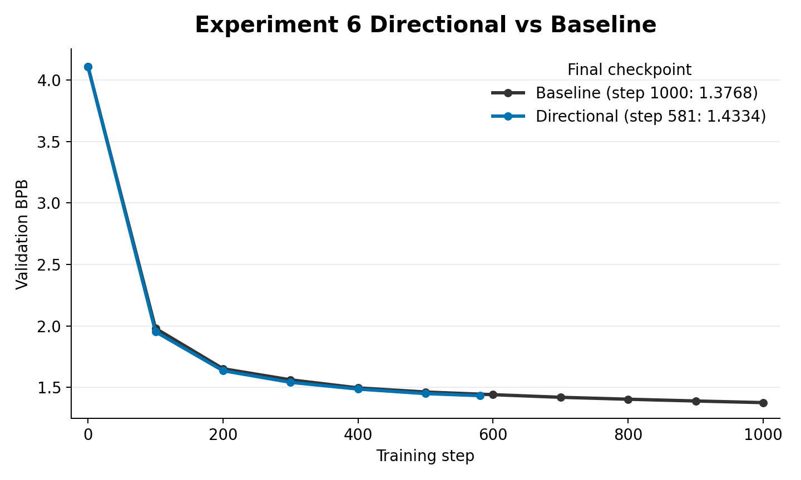
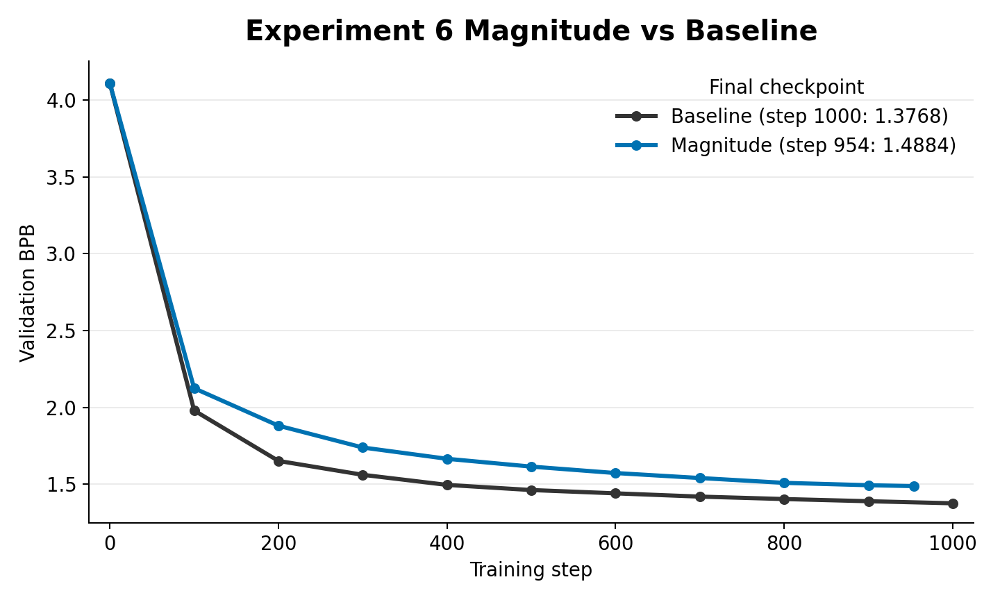

# Experiment 6: Teacher Directional Distillation

This is the first teacher-prior experiment. Instead of extracting statistics directly from the data, `teacher_directional.py` loads a trained teacher checkpoint and asks the student to match the teacher's layer update directions.

The script captures per-layer residual deltas:

`delta_l = h_after_block_l - h_before_block_l`

It then compares student and teacher deltas for selected layer pairs using:

- direction loss: `1 - cosine_similarity(delta_student, delta_teacher)`
- optional magnitude loss: MSE between log delta norms

## Contents

- [How this came from experiment 5](#how-this-came-from-experiment-5)
- [What changed from experiment 5](#what-changed-from-experiment-5)
- [How the teacher signal is created](#how-the-teacher-signal-is-created)
- [How the teacher is loaded into the experiment](#how-the-teacher-is-loaded-into-the-experiment)
- [Code changes from `train_gpt.py`](#code-changes-from-train_gptpy)
- [Important files](#important-files)
- [Results](#results)
- [How this led to experiment 7](#how-this-led-to-experiment-7)

## How this came from experiment 5

Experiment 5 was still a data-prior method: a compact bigram transition module. The next idea was that a trained teacher contains richer information than any bigram table, especially about how representations should transform inside the network.

So experiment 6 moved from data priors to teacher priors.

## What changed from experiment 5

- Loaded a frozen teacher model from `TEACHER_PATH`.
- Added `DISTILL_LAYER_PAIRS`.
- Added `DELTA_DIR_LAMBDA` and `DELTA_MAG_LAMBDA`.
- Added a forward path that exposes selected block deltas.

## How the teacher signal is created

The teacher is a trained checkpoint produced by the baseline training stack. By default, `TEACHER_PATH` points to `./small_teacher.pt`.

This marks the transition from data priors to teacher priors: the signal comes from a trained model's internal residual updates, not directly from token-count statistics.

## How the teacher is loaded into the experiment

`teacher_directional.py` constructs a teacher model, loads `TEACHER_PATH`, restores low-dimensional/control tensors to fp32 when needed, switches the teacher to eval mode, and freezes all teacher parameters.

During training, the teacher runs under `torch.no_grad()` on the same batch as the student. Both models expose selected layer deltas through `forward_with_deltas(...)`, and the student is penalized when its deltas point in a different direction from the teacher's deltas.

## Code changes from `train_gpt.py`

`../train_gpt.py` is the baseline comparison script. The meaningful changes in `experiment_6/teacher_directional.py` are:

- Added `TEACHER_PATH`, `DISTILL_LAYER_PAIRS`, `DELTA_DIR_LAMBDA`, and `DELTA_MAG_LAMBDA`.
- Added teacher checkpoint loading, freezing, and eval-mode setup.
- Added `forward_with_deltas(...)` to return CE loss and selected residual-stream block deltas.
- Added `delta_distill_losses(...)` for cosine direction loss and optional log-norm magnitude loss.
- Changed the training objective to `CE + delta_direction + delta_magnitude` when a teacher is active.
- Logged CE, direction loss, magnitude loss, and average cosine diagnostics separately.

## Important files

- `teacher_directional.py`: experiment script.

## Results

### Directional Loss

The directional-only run stopped at step `581` and reached `1.4334` validation BPB. Around the same budget, this is close to the baseline's step-600 value of `1.4414`, but the run did not complete the full 1000-step smoke comparison.

### Magnitude Loss

The magnitude-only run stopped at step `954` and reached `1.4884` validation BPB, underperforming the 1000-step baseline value of `1.3768`.

## How this led to experiment 7

Matching hidden deltas is a dynamic teacher signal. The next simpler teacher-prior question was whether the teacher's learned weight geometry alone could give the student a better start.

That led to experiment 7: initialize student matrices from low-rank SVD reconstructions of teacher weights.
