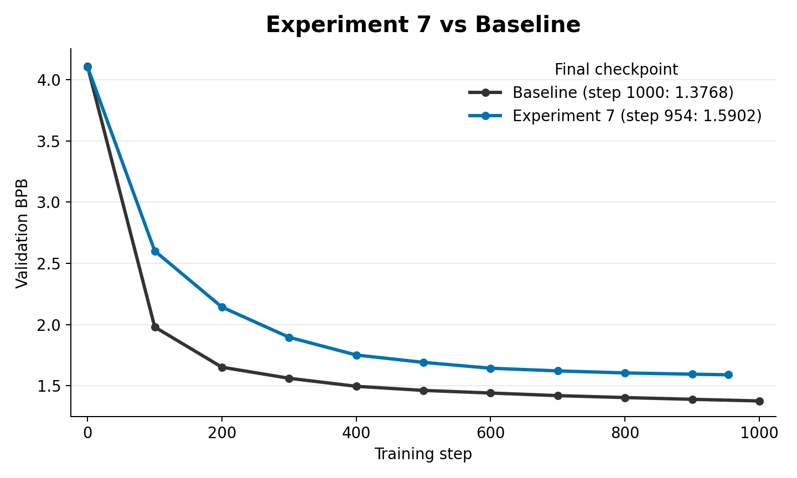

# Experiment 7: Teacher SVD Initialization

This experiment uses a trained teacher checkpoint to initialize selected student weight matrices. `teacher_svd_init.py` takes teacher attention and MLP matrices, computes truncated SVD reconstructions, and copies those rank-limited reconstructions into the matching student parameters.

The default target families are:

- attention projections: query, key, value, output
- MLP projections: up and down

This is an init-only teacher prior. After initialization, training proceeds normally.

## Contents

- [How this came from experiment 6](#how-this-came-from-experiment-6)
- [What changed from experiment 6](#what-changed-from-experiment-6)
- [How the teacher prior is created](#how-the-teacher-prior-is-created)
- [How the teacher is loaded into the experiment](#how-the-teacher-is-loaded-into-the-experiment)
- [Code changes from `train_gpt.py`](#code-changes-from-train_gptpy)
- [Important files](#important-files)
- [Results](#results)
- [How this led to experiment 8](#how-this-led-to-experiment-8)

## How this came from experiment 6

Experiment 6 used the teacher dynamically during training by matching activation update directions. Experiment 7 stepped back to a simpler question: does the teacher's learned weight geometry help if it is only used to choose the student's starting point?

This tests a static teacher prior before adding persistent teacher constraints.

## What changed from experiment 6

- Removed hidden-state delta matching as the main idea.
- Added `SVD_INIT_ENABLED`.
- Added `SVD_INIT_PATH`, `SVD_INIT_RANK`, `SVD_INIT_ATTENTION`, and `SVD_INIT_MLP`.
- Required same-shaped teacher and student matrices for direct SVD reconstruction.

## How the teacher prior is created

The teacher prior is a trained checkpoint from the baseline model family. Instead of using teacher activations during training, this experiment extracts structure from the teacher's learned weight matrices before student training starts.

The target matrices are attention projections (`attn.c_q`, `attn.c_k`, `attn.c_v`, `attn.proj`) and MLP projections (`mlp.fc`, `mlp.proj`), controlled by `SVD_INIT_ATTENTION` and `SVD_INIT_MLP`.

## How the teacher is loaded into the experiment

`SVD_INIT_PATH` points at the teacher checkpoint. `teacher_svd_init.py` normalizes checkpoint keys, finds student parameters with matching names and shapes, runs truncated SVD on the teacher tensor, reconstructs it at rank `SVD_INIT_RANK`, and copies the reconstruction into the student parameter.

After that copy, the teacher is no longer used. The run trains with ordinary cross-entropy from the SVD-initialized starting point.

## Code changes from `train_gpt.py`

`../train_gpt.py` is the baseline comparison script. The meaningful changes in `experiment_7/teacher_svd_init.py` are:

- Added `SVD_INIT_ENABLED`, `SVD_INIT_PATH`, `SVD_INIT_RANK`, `SVD_INIT_ATTENTION`, and `SVD_INIT_MLP`.
- Added teacher state-dict loading with key normalization.
- Added target-parameter filtering for attention and MLP matrices.
- Added truncated SVD reconstruction for matching teacher/student tensors.
- Applied the reconstructed teacher tensors after model construction and before optimizer setup/training.
- Logged whether SVD init was enabled, the rank, the source checkpoint, and which tensors were initialized.

## Important files

- `teacher_svd_init.py`: experiment script.

## Results

The teacher SVD initialization smoke run stopped at step `954` and reached `1.5902` validation BPB, underperforming the 1000-step baseline value of `1.3768`.

## How this led to experiment 8

If teacher SVD initialization helps only at step zero, it is hard to know whether the useful part is the starting weights or staying near the teacher's principal subspaces.

That led to experiment 8: keep random initialization, but add a persistent teacher-subspace regularizer.
